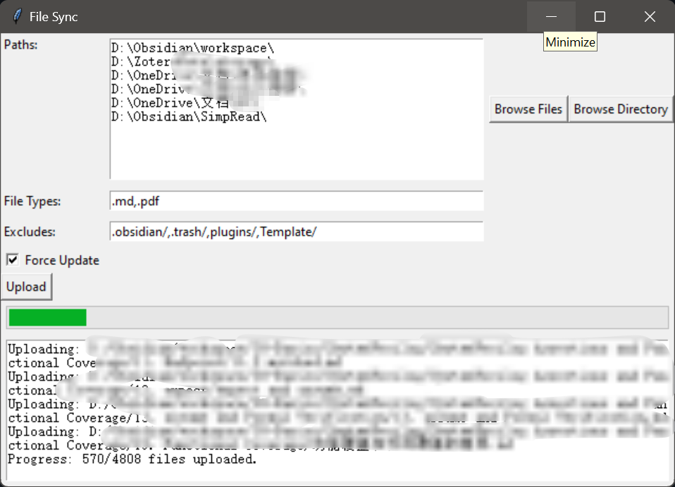

# Khoj-Uploader

Khoj-Uploader is a user-friendly tool designed to facilitate the selection and upload of files and folders to a Khoj server, which is a DAG-based large language model. Once uploaded, the files are embedded for future conversational retrieval, allowing you to build and maintain your personal knowledge base.


## Features

- **File and Folder Selection**: Easily select individual files or entire folders to upload.
- **File Type Filtering**: Specify which file types should be included in the upload process.
- **Path Exclusion**: Exclude specific paths from being uploaded.
- **Force Update Option**: Toggle to force upload even if the files have not been modified.
- **Progress Tracking**: Visual progress bar to track the overall upload completion status.

## Installation

To use Khoj-Uploader, clone this repository and ensure you have Python installed on your system. You will also need to install the required packages using pip:

```bash
git clone https://github.com/yourusername/Khoj-Uploader.git
```
## Usage
After installation, you can start the application by running:

```bash
cd Khoj-Uploader
python khoj_uploader.py
```

This will launch the graphical interface where you can configure your upload settings:

1. Paths: Load paths from a configuration file or manually add paths using the provided interface.
2. File Types: Enter the file extensions you want to be included in the upload, separated by commas.
3. Excludes: Specify paths to exclude during the upload process.
4. Force Update: Tick the checkbox if you want to force the upload of all files, regardless of modification status.
5. Upload: Click the upload button to begin the process. The progress bar will indicate the status of the upload.